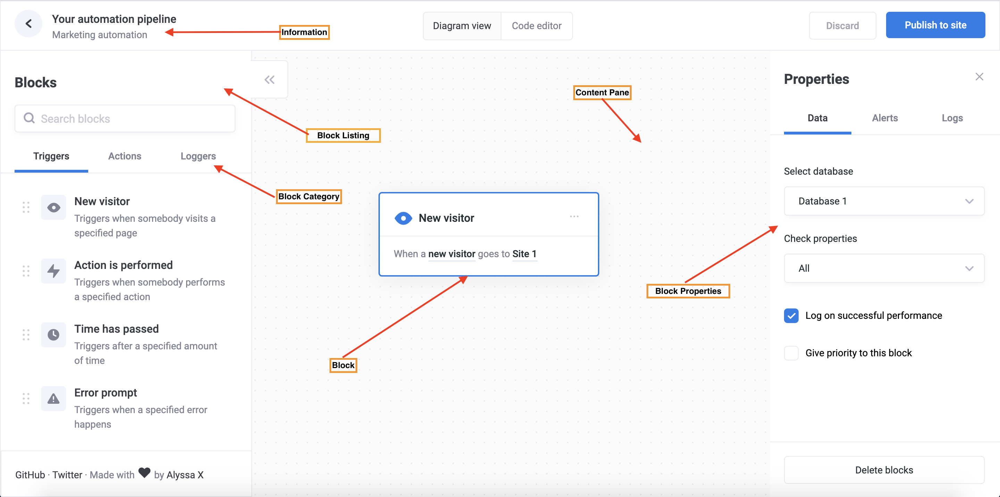

# Skill Builder Docs (v2)

Here is user interface building blocks. Before moving further read them carefully.

* Skill Form
* Block Listing
* Content Pane
* Block Properties 
* Block Connections





###### Typical  Builder Navigation

```yaml
Build Skill > Open Modal > Take Skill Information eg. name, package, summary etc. > Next > Open Full Screen  Editor > User: Drag Drops the Blocks and Connect them to the different block. > Exports
```


## Skill Form 

Take required skill information from user, for this we can show modal form. After user click next show full screen editor. This information must be editibable by clicking title on full screen editor later. Here is form fields.

```json
name, package, component, summary, description, category, start
```


##### Name

Human readable name for this skill, It could be same for another skill. The name should represent clear purpose of skill. It is important to name it right to publish on Bigbot store.


##### Package

It is unique identifier globally, two skill with same package name cannot be possible. Additionally It is important to publish skill on Bigbot store. Once publish and approved it is not possible to change skill package name. If this package is reserved by some other publisher store won't allow to publish , in that case package name need to be change before publish. This package name is also important to execute different skill within same component.

###### API

```http
GET https://console.igotbot.com/api/v3/store/package
```


##### Component 

It is the qualified name of your skill's component, all business logic will be handle within this component. It is important component to present in system otherwise skill imports like action will through an error.  Component discovery is available over REST API.

###### API

```http
GET https://console.igotbot.com/api/v3/store/package
```

##### 

##### Summary 

Short summary of skill , it will be helpful for publishing on Bigbot store. 


##### Description 

Long text description of skill , put all the long details of your skill, user will mentioned what this skill does. 


##### Category 

Skill category, user can select from pre define category, default is 1.


## Block Listing 

Block listing is list of available workflow blocks, since this is dynamic this list can be obtain over API. Each block belong to some category. This category should can be used for grouping list. 


###### API

```http
GET https://console.igotbot.com/api/v3/skill/builder/blocks
```

##### 

## Content Pane

It is the main blank area where user can drag drop blocks, from block listing. Also it can be useful for modifying block properties by clicking them. Whenever some block dropped on content pane , it must generate unique key in background, this is for identifying block itself, since user can drop two same type of block, this key become useful in such situation, as well it is, also required to validating skill and making block connection later.


 ## Block Properties 

Each block can have one or more properties. These properties are dynamic, and can be obtain through block API. These must render through template of block. 

Need to show these under Block properties as per format, when specific block has been selected. Only those marks as important should be fine for initial development. Here is details

##### string (important)

Input type text.

```json
# Render Template
{
   "name": "name",
   "format": "string"
}

# Output Sample
{
    "name": "name",
    "value":"Hello world!"
}
```

##### integer

Input type text with integer validation. 

```json
# Render Template
{
   "name": "name",
   "format": "integer"
}

# Output Sample
{
    "name": "name",
    "value":35
}
```

##### float

Input type text with float validation. 

```json
# Render Template
{
   "name": "name",
   "format": "float"
}

# Output Sample
{
    "name": "name",
    "value":31.90
}
```

##### boolean(important)

Input type checkbox, (show checkbox)

```json
# Render Template
{
   "name": "name",
   "format": "boolean"
}

# Output Sample
{
    "name": "name",
    "value":false
}
```


##### color

Allow user to pick color.

```json
# Render Template
{
   "name": "name",
   "format": "color"
}

# Output Sample
{
    "name": "name",
    "value":"#3BB9FF"
}
```


##### email

It is text input along side email validation.

```json
# Render Template
{
   "name": "name",
   "format": "email"
}

# Output Sample
{
    "name": "name",
    "value":"test@abigbot.com"
}
```


##### url

It is text input along side url validation.

```json
# Render Template
{
   "name": "name",
   "format": "email"
}

# Output Sample
{
    "name": "name",
    "value":"https://abigbot.com"
}
```


##### date

Allow user to pick date.

```json
# Render Template
{
   "name": "name",
   "format": "date"
}

# Output Sample
{
    "name": "name",
    "value":""2020-12-25"
}
```


##### datetime

Allow user to pick date and time.

```json
# Render Template
{
   "name": "name",
   "format": "date"
}

# Output Sample
{
    "name": "name",
    "value":"2020-12-25 19:23:11"
}
```


##### time

Allow user to pick date and time.

```json
# Render Template
{
   "name": "name",
   "format": "time"
}

# Output Sample
{
    "name": "name",
    "value":"19:23:11"
}
```


##### enum (important)

Allow user to pick from list. (drop down)

```json
# Render Template
{
   "name": "name",
   "format": "enum",
   "enum":[
     ["draft","0"],
     ["progress","1"],
   ]
}

# Output Sample
{
    "name": "name",
    "value":["draft","0"]
}
```


### Block Connection 

Each block can connect to other block, these connection are dynamic. These are depended of block properties, whenever block properties changes number of connection can change too. 

###### API

```http
POST https://console.igotbot.com/api/v3/store/connections
```

###### sample

```json
# Example 1: 
# It means this block can have only one possible connection to other block.
# Where -1 is key of this connection and Next is dispaly text on connection arrow.
[[-1,"Next"]]

# Example 2:
# It means three possible connections.
[["0","draft"],["1","progress"],["2","approved"]]

```

The above sample for getting possible connection. These must convert to proper array while validating entire skill. 

###### API

```http
POST https://console.igotbot.com/api/v3/store/validate
```

###### sample

```json
# Example 1: 
# It represent the -1 connection has been connected to some block whose key (unique block key) is "ce3e922d-8941-4981-b790-1789bc30c30d"
[[-1,"ce3e922d-8941-4981-b790-1789bc30c30d"]]

# Example 2:
[["0","ce3e922d-8941-4981-b790-1789bc30c30d"],......]
 
# Example 3:
# It  represent "0" is not connected to any block.
[["0", null]]

```


### Export JSON

One properties  validated, It can be exported as json. Here is full sample of exported JSON.


```json
{
    "name": "Google Event",
    "summary": "Post event to your google calendar.",
    "description": "Helps to create google calendar event using google api.",
    "category": 1,
    "package": "com.big.bot.google.event",
    "component": "apps.bigbot.google.GoogleAdapter",
    "data": [
      {
        "key": "ce3e922d-8941-4981-b790-1789bc30c30d",
        "component": "apps.bigbot.component.TerminalBlock",
        "properties": [
          {
            "name": "type",
            "value": "start"
          },
          {
            "name": "exit",
            "value": null
          }
        ]
      },
      {
        "connections": [
          [
            -1,
            "08446b41-8b55-4b97-ad1f-a84c4e5dc88f"
          ]
        ]
      }
    ]
  }
```


